# Entity-Relationship Diagram

Source of truth for how the core tables, the per-service usage breakdown, and
the dynamic-column registry relate to each other. See `data/schema.sql` for
the actual DDL.

```mermaid
erDiagram
    customers ||--o{ usage_metrics : has
    customers ||--o{ service_usage : has
    customers ||--o{ support_tickets : files
    customers ||--o{ transactions : makes
    product_catalog ||--o{ transactions : "purchased in"
    product_catalog ||--o| product_embeddings : "embedded as"

    customers {
        text customer_id PK
        text customer_name
        text industry
        text plan_tier
        int seats
        date renewal_date
        text archetype "synthetic-data only"
        json extra_attributes "tenant-specific columns, see dynamic_field_registry"
    }
    usage_metrics {
        int id PK
        text customer_id FK
        date month
        int active_users
        real storage_used_gb
        real storage_limit_gb
        real feature_usage_score "derived rollup, see app/usage_rollup.py"
        json extra_attributes
    }
    service_usage {
        int id PK
        text customer_id FK
        date month
        text service_name
        real usage_count
        real usage_pct_of_plan
    }
    support_tickets {
        text ticket_id PK
        text customer_id FK
        date created_at
        text category
        text subject
        boolean resolved
        json extra_attributes
    }
    product_catalog {
        text product_id PK
        text product_name
        int tier_level
        real price_per_seat
        text complements
        text category
        text description
        json extra_attributes
    }
    product_embeddings {
        text product_id PK
        blob embedding
        text embedded_text
        text model_name
    }
    transactions {
        text transaction_id PK
        text customer_id FK
        text product_id FK
        date purchase_date
        real amount
    }
    tenant_config {
        text tenant_id PK
        boolean use_llm
        text llm_provider "IndiaAI"
        boolean use_vector_search
    }
    column_mappings {
        text tenant_id PK
        text dataset_type PK
        text internal_field PK
        text source_column
        boolean confirmed_by_user
    }
    dynamic_field_registry {
        text tenant_id PK
        text dataset_type PK
        text field_name PK
        text source_column
        text inferred_type
        text semantic_role
        text description
        text relevance "profile_creation | churn_signal | deal_scoring | ignore"
        real confidence
    }
    tenant_profiles {
        text tenant_id PK
        real usage_baseline_p50
        real usage_baseline_p90
        real avg_deal_size
        int renewal_window_days
    }
    recommendations_log {
        int id PK
        text customer_id
        text churn_risk
        text recommended_product
        real revenue_score
        text agent_trace
        text outcome
    }
```

## Notes

- `extra_attributes` (JSON, on `customers` / `usage_metrics` /
  `support_tickets` / `product_catalog`) holds any tenant column that doesn't
  map to a known field — additive only, never replaces a fixed column.
- `dynamic_field_registry` is the metadata layer describing what each
  `extra_attributes` key actually means (LLM-classified at ingestion time,
  see `schema_mapping.discover_unmapped_columns()`), so agents can decide
  whether/how to use it without any tenant-specific code.
- `service_usage` replaces what used to be an opaque
  `usage_metrics.feature_usage_score` input — that column is now a derived
  rollup over these rows (`app/usage_rollup.py`), so it stays citable back to
  specific services.
- `tenant_id` is not yet a column on the core tables (`customers`,
  `usage_metrics`, etc.) — see the "Known limitation" note in the main
  README. `tenant_config`, `column_mappings`, and `dynamic_field_registry`
  are already tenant-scoped; the core data tables are the pending migration.
